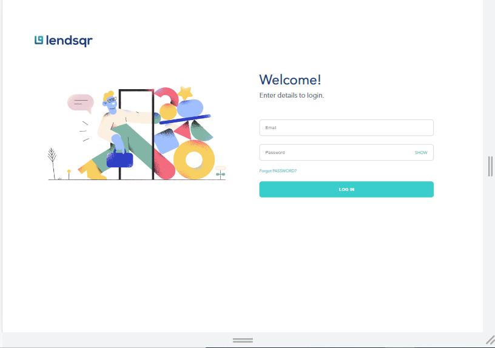
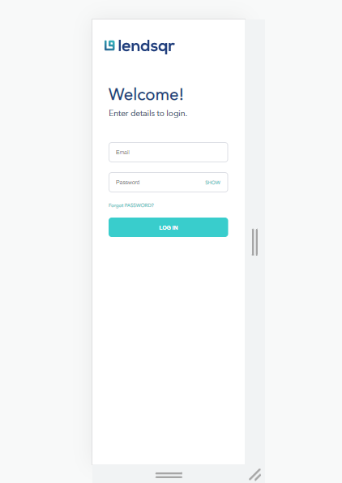

# Project OverView

An interview assesment with the main of finding out my knowledge on some key technologies

# Expectation

I was expected to replicate a figma design and implement the following
1. Build the 4 pages Login, Dashboard, User page, User details page
2. The user pages should pull data from a mock api with 100 records
3. Use local storage or indexedDB to store and retrieve user details on the user details page.
4. The page must be mobile responsive
# Actual Work

In response to the expectations, I built the 4 pages required(Screenshots below)

 ## Dashboard(Desktop) view
 
 

 ## Dashboard (Mobile) view
 

 ## Dashboard Side Bar
 

 ## Dashboard Pop Ups
 

 ## User Details Page (Desktop)
 
 ## User Details Page (Mobile)
 

 ## Login Page(Desktop)


## Login Page(Mobile)


# Unit Testing

Apart from the required work, I was also able to run unit test on the dashboard component to make sure it was displaying fine to the viewers on the browser.

A code snippet for the unit test below

```
describe('Test suite for Dashboard Page', () => {

  it('renders the navbar on the dashboard', () => {
    render(<Dashboard />);
    const navElement = screen.getByRole('navigation');
    expect(navElement).toBeInTheDocument();
  })
  
  it('renders the sidebar on the dashboard', async () => {
    render(<Dashboard />);
    const sideBar = await screen.findByTestId('sidebar');
    expect(sideBar).toBeVisible();
  })
  
  it('renders users data on the dashboard', async () => {
    render(<Dashboard />);
    const usersData = await screen.findByTestId('users-data');
    expect(usersData).toBeVisible();
  })
});
```
An Image of the test output below:


# Technologies Used
Technologies used 
1. React(TypeScript)
2. SASS(for styling)
3. Git

# Link and paths
1. Login page - '/login'
2. Dashboard page - '/'
3. User Details Page - '/user/{unique_id}'
# Challenges

Some of the major challenges faced on these project are as follows
1. Having to understand the whole instructions took a lot of time, this was beacause I didn't plan to leave anything out

2. Running Unit test with React TypeScript was a little bit tricky but I was able to acheive it

# Conclusion

This project was fun working on and it gives me a bit of knowlegde about what to expect at lendsqr when given the opporuntity to work in the team